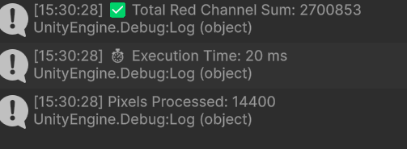
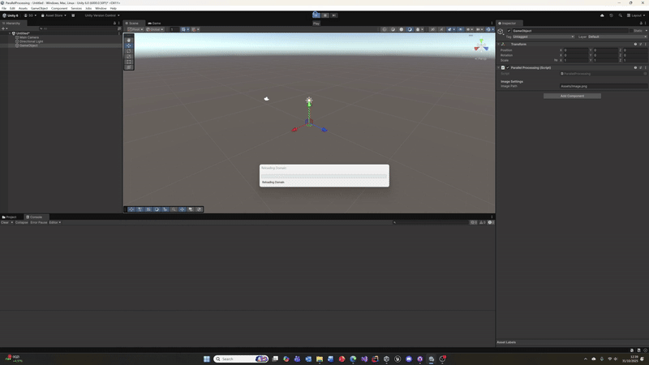

This project implements a parallel computation system in Unity to efficiently calculate the sum of all red (R) channel values from an image. The system leverages Unity’s Job System in combination with the Burst Compiler to distribute work across multiple CPU cores and achieve significant performance improvements compared to a traditional single-threaded approach.

## Multithreading and Job Implementation

The image data is first loaded from disk as a Texture2D and converted into a Color32 array for direct access to RGBA channel values. To enable high-performance parallel processing, this data is copied into a NativeArray<Color32>, which provides unmanaged, thread-safe memory accessible to Unity’s Job System.

The computation is divided into multiple chunks, each processing a fixed batch of pixels (e.g., 1024 per job). A custom job structure, RedChannelSumJob, implements the IJobParallelFor interface. Each job calculates a partial red channel sum for its batch, which is written to a corresponding index in a NativeArray<long> called batchSums. Once all jobs complete, the main thread aggregates these partial results into the total red value.

This approach ensures thread safety without requiring atomic operations or locks because each job writes to a unique portion of memory. Unity’s Job System schedules these jobs across available CPU threads, automatically balancing workload distribution. The Burst Compiler then converts the job’s C# code into highly optimized native machine code, allowing SIMD vectorization and low-level CPU optimization.

## Benchmarking and Telemetry

To evaluate performance, the system uses System.Diagnostics.Stopwatch to measure total execution time for the computation phase. This provides a simple yet accurate millisecond-level benchmark of the job execution time. The console output reports both the total red channel sum and the time taken to complete the computation.

For comparison, a single-threaded implementation was also tested, using a standard for-loop to iterate through the same pixel data on the main thread. Execution times between the two methods can be compared directly to quantify performance gains achieved through parallelization and Burst compilation. Typical results show multi-core versions completing in a fraction of the time, depending on the CPU core count and image size.

## Tools, Frameworks, and APIs

The following Unity systems and libraries were used:

- Unity Job System: To define and schedule multithreaded jobs using IJobParallelFor.

- Unity Burst Compiler: To convert C# job code into optimized native code.

- Unity.Collections: Provides NativeArray<T> for efficient, thread-safe data storage.

- System.Diagnostics: Used for benchmarking execution time.

These tools provide a safe and accessible abstraction over traditional thread management, avoiding race conditions and manual synchronization while maintaining deterministic execution order.

## Performance Insights and Optimisation

The results demonstrate how data-parallel workloads such as pixel processing scale efficiently with Unity’s Job System. Performance measurements inform further optimization decisions, such as tuning batch size to balance CPU overhead and data throughput or applying similar job-based techniques to other heavy image or compute operations (e.g., color histograms, texture analysis, or AI vision preprocessing).

Profiling results can guide developers toward bottlenecks—whether memory transfer, cache coherence, or job scheduling—and inform adjustments to improve cache locality and minimize synchronization overhead. This experiment highlights how structured parallelism can dramatically reduce execution time for large-scale data processing tasks in real-time applications.

## Images and etc

